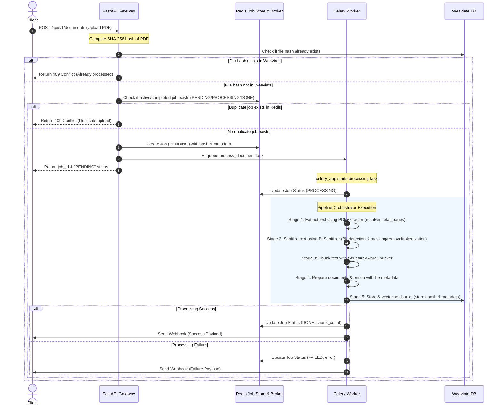

# Document Ingestion & Semantic Search Pipeline

An asynchronous, production-ready pipeline for ingesting PDF documents, extracting their text page-by-page, splitting them into token-bounded chunks, generating embeddings, storing them in Weaviate, and querying them semantically.

The workflow is orchestrated using **FastAPI** for the API gateway, **Celery** (backed by **Redis**) for background tasks, and **Weaviate** for vector storage.

---

## Table of Contents

- [Features](#features)
- [Architecture & Processing Flow](#architecture--processing-flow)
- [Project Directory Structure](#project-directory-structure)
- [Configuration](#configuration)
- [Getting Started](#getting-started)
  - [Option A: Running with Docker Compose (Recommended)](#option-a-running-with-docker-compose-recommend)
  - [Option B: Running Locally (Manual Setup)](#option-b-running-locally-manual-setup)
- [API Reference](#api-reference)
  - [1. Upload Document](#1-upload-document)
  - [2. Get Job Status](#2-get-job-status)
  - [3. Semantic Search Query](#3-semantic-search-query)
  - [4. Health Check](#4-health-check)
- [Webhook Delivery](#webhook-delivery)
- [Running Tests](#running-tests)
- [Logging & Observability](#logging--observability)

---

## Features

- **Asynchronous Task Processing**: Decoupled document processing via Celery and Redis so uploads are instant.
- **Robust PDF Text Extraction**: Uses `pdfplumber` for structured page-by-page extraction, with an automatic fallback to `pdfminer.six` if layout complexity demands it.
- **Structure-Aware Chunking**: Chunks documents into token-bounded segments while preserving page numbers and formatting context.
- **Auto-Vectorization**: Integrates directly with Weaviate v4's vectorizer module (`text2vec-transformers`) using a local Sentence Transformers engine (`all-MiniLM-L6-v2`).
- **Semantic Queries**: Offers a dedicated endpoint to query document chunks with high-performance vector similarity scores.
- **Webhooks**: Optional callback URLs can be defined per job or globally to notify external systems upon completion or failure.

---

## Architecture & Processing Flow

The diagram below outlines the ingestion process when a PDF is uploaded, including duplicate file prevention (deduplication) checks:



---

## Project Directory Structure

```text
knowledge-ingestion-workflow/
├── app/
│   ├── api/
│   │   ├── routes/
│   │   │   ├── ingestion.py      # /documents and /jobs/{id} routes
│   │   │   └── query.py          # /query route for semantic search
│   │   └── schemas.py            # Pydantic request/response schemas
│   ├── chunking/
│   │   ├── base.py               # Abstract Chunker class
│   │   └── structure_aware.py    # Chunk splitting logic (token size & overlap)
│   ├── embedding/
│   │   └── weaviate_vectorizer.py# Deprecated/reference Weaviate schema definitions
│   ├── extraction/
│   │   ├── base.py               # Abstract Extractor class
│   │   ├── factory.py            # Extractor Factory mapping mime-types
│   │   └── pdf_extractor.py      # PDF plumbing / pdfminer logic
│   ├── models/
│   │   └── job.py                # Job data model
│   ├── notifications/
│   │   └── webhook.py            # Webhook dispatch HTTP client
│   ├── pipeline/
│   │   ├── logger.py             # Pipeline logging config (pipeline.log)
│   │   ├── orchestrator.py       # Orchestrates the 5 stages of ingestion
│   │   ├── sanitizer.py          # PII Sanitizer and policy engine
│   │   └── stages.py             # Individual Stage executions (Extract, Sanitize, Chunk, Embed, Store)
│   ├── repositories/
│   │   ├── job_store.py          # Redis client wrapper for Job state persistence
│   │   └── vector_store.py       # Weaviate client wrapper for CRUD/Vector Search
│   ├── workers/
│   │   ├── celery_app.py         # Celery application configuration
│   │   └── tasks.py              # Celery background tasks
│   ├── config.py                 # Pydantic BaseSettings config
│   └── main.py                   # FastAPI Application initialization
├── tests/
│   ├── integration/
│   │   └── test_pipeline.py      # Full mock pipeline integration test
│   └── unit/
│   │   ├── test_chunker.py       # Chunker split & overlap unit tests
│   │   ├── test_extractors.py    # Extractor fallback logic tests
│   │   └── test_job_store.py     # Redis Job persistence unit tests
├── Dockerfile                    # Multi-stage python image
├── docker-compose.yml            # Multi-service local ecosystem setup
├── requirements.txt              # Project dependencies list
└── pipeline.log                  # Orchestrator logging target (auto-created)
```

---

## Configuration

The application uses environment variables or a `.env` file to manage configurations. Copy the template to start:

```bash
cp .env.example .env
```

### Config Options

| Variable Name | Default Value | Description |
|---|---|---|
| `APP_ENV` | `development` | Environment mode (`development` or `production`). |
| `APP_DEBUG` | `true` | Toggle FastAPI debug mode. |
| `APP_HOST` | `0.0.0.0` | IP interface to bind FastAPI. |
| `APP_PORT` | `8000` | Port to bind FastAPI. |
| `REDIS_URL` | `redis://redis:6379/0` | URL for the Redis server storing jobs and Celery tasks. |
| `WEAVIATE_URL` | `http://weaviate:8080` | HTTP URL to the Weaviate instance. |
| `WEAVIATE_GRPC_PORT` | `50051` | gRPC port for fast vector inserts/queries in Weaviate. |
| `WEAVIATE_CLASS_NAME` | `DocumentChunk` | Collection/Class name where document vectors are stored. |
| `CELERY_BROKER_URL` | `redis://redis:6379/0` | Celery broker connection string. |
| `CELERY_RESULT_BACKEND`| `redis://redis:6379/0` | Celery task result backend. |
| `DEFAULT_WEBHOOK_URL` | `""` | Global fallback webhook URL to send process notifications. |
| `CHUNK_MAX_TOKENS` | `750` | Maximum token limit per text chunk. |
| `CHUNK_OVERLAP_TOKENS` | `100` | Token overlap size between successive chunks. |
| `PII_POLICY` | `mask` | PII sanitization policy (`mask`, `remove`, `tokenize`). |
| `WEAVIATE_HYBRID_ALPHA` | `0.5` | Weight for hybrid search blending (`1.0` = semantic vector search, `0.0` = keyword BM25 search). |
| `WEAVIATE_RERANKING` | `true` | Toggle cross-encoder rerank module query execution. |

---

## Getting Started

### Option A: Running with Docker Compose (Recommended)

This compiles and links the API server, Celery worker, Redis, Weaviate DB, and a local Sentence-Transformers inference service.

1. **Start all services**:
   ```bash
   docker compose up -d --build
   ```

2. **Verify running containers**:
   ```bash
   docker compose ps
   ```

This will run:
- FastAPI App on http://localhost:8000
- Redis on port 6379
- Weaviate REST on http://localhost:8080 (gRPC on port 50051)
- sentence-transformers inference API on http://localhost:8082

---

### Option B: Running Locally (Manual Setup)

Prerequisites: Redis and Weaviate must be running on your local machine.

1. **Create and activate a virtual environment**:
   ```bash
   python3 -m venv venv
   source venv/bin/activate
   pip install -r requirements.txt
   ```

2. **Run Redis locally**:
   Ensure Redis is running locally on port `6379`.
   ```bash
   redis-server
   ```

3. **Start the API Server**:
   ```bash
   uvicorn app.main:app --reload --port 8000
   ```

4. **Start the Celery Worker**:
   ```bash
   CELERY_BROKER_URL=redis://localhost:6379/0 celery -A app.workers.celery_app worker --loglevel=info
   ```

---

## API Reference

The interactive API documentation is automatically generated by FastAPI at http://localhost:8000/docs.

### 1. Upload Document

Asynchronously uploads and schedules a PDF for ingestion. Performs deduplication validation against processed documents in Weaviate and active/completed jobs in Redis.

- **URL**: `/api/v1/documents`
- **Method**: `POST`
- **Headers**:
  - `X-Webhook-URL` *(Optional)*: A webhook endpoint to trigger on completion. Overrides `DEFAULT_WEBHOOK_URL`.
- **Payload**: `multipart/form-data` with key `file` (must be a PDF).

**Example Request:**
```bash
curl -X POST "http://localhost:8000/api/v1/documents" \
  -H "X-Webhook-URL: http://your-app.com/webhook" \
  -F "file=@/path/to/document.pdf"
```

**Response:**
```json
{
  "job_id": "7ac15339-4d2d-45db-91b3-6c7b0bc88823",
  "status": "PENDING"
}
```

**Response (Duplicate / Conflict - 409):**
```json
{
  "detail": "File has already been uploaded and processed."
}
```

---

### 2. Get Job Status

Fetches the progress of an active or historical ingestion task, exposing file metadata details.

- **URL**: `/api/v1/jobs/{job_id}`
- **Method**: `GET`

**Example Request:**
```bash
curl -X GET "http://localhost:8000/api/v1/jobs/7ac15339-4d2d-45db-91b3-6c7b0bc88823"
```

**Response (In-Progress):**
```json
{
  "job_id": "7ac15339-4d2d-45db-91b3-6c7b0bc88823",
  "filename": "document.pdf",
  "status": "PROCESSING",
  "created_at": "2026-07-21T19:42:00Z",
  "updated_at": "2026-07-21T19:42:05Z",
  "chunk_count": null,
  "error": null,
  "file_hash": "e8c1f14b404960f52ec5ea27630650d522639026fb0d223e9a092188d6b815ad",
  "file_size": 17555,
  "mime_type": "application/pdf"
}
```

**Response (Success):**
```json
{
  "job_id": "7ac15339-4d2d-45db-91b3-6c7b0bc88823",
  "filename": "document.pdf",
  "status": "DONE",
  "created_at": "2026-07-21T19:42:00Z",
  "updated_at": "2026-07-21T19:42:15Z",
  "chunk_count": 42,
  "error": null,
  "file_hash": "e8c1f14b404960f52ec5ea27630650d522639026fb0d223e9a092188d6b815ad",
  "file_size": 17555,
  "mime_type": "application/pdf"
}
```

---

### 3. Hybrid Search Query with Cross-Encoder Reranking

Queries Weaviate using a hybrid search (blending semantic vector retrieval and BM25 keyword matching) and runs a post-search reranking stage using a Cross-Encoder transformer model. Returns source file metadata along with search score and rerank score metrics.

- **URL**: `/api/v1/query`
- **Method**: `POST`
- **Payload**:
```json
{
  "query": "What is the token limit of the chunker?",
  "limit": 3
}
```

**Example Request:**
```bash
curl -X POST "http://localhost:8000/api/v1/query" \
  -H "Content-Type: application/json" \
  -d '{"query": "token limit of the chunker", "limit": 2}'
```

**Response:**
```json
{
  "query": "token limit of the chunker",
  "results": [
    {
      "text": "The StructureAwareChunker enforces a max_tokens parameter, which defaults to 750 tokens...",
      "filename": "tmp_ykw72ma.pdf",
      "page_numbers": [3],
      "section_path": "",
      "distance": null,
      "score": 0.87532,
      "rerank_score": -4.47159,
      "file_hash": "e8c1f14b404960f52ec5ea27630650d522639026fb0d223e9a092188d6b815ad",
      "file_size": 17555,
      "mime_type": "application/pdf",
      "total_pages": 4,
      "original_file_name": "documentation.pdf"
    },
    {
      "text": "Overlap tokens parameter is used to allow chunking continuity across overlapping lines...",
      "filename": "tmp_ykw72ma.pdf",
      "page_numbers": [4],
      "section_path": "",
      "distance": null,
      "score": 0.76541,
      "rerank_score": -5.16706,
      "file_hash": "e8c1f14b404960f52ec5ea27630650d522639026fb0d223e9a092188d6b815ad",
      "file_size": 17555,
      "mime_type": "application/pdf",
      "total_pages": 4,
      "original_file_name": "documentation.pdf"
    }
  ],
  "total": 2
}
```

---

### 4. Health Check

Verifies basic API server availability.

- **URL**: `/health`
- **Method**: `GET`

**Response:**
```json
{
  "status": "ok"
}
```

---

### 5. List Ingested Documents & Metadata

Returns a unique list of all successfully processed documents stored in Weaviate, along with their metadata.

- **URL**: `/api/v1/documents`
- **Method**: `GET`

**Example Request:**
```bash
curl -X GET "http://localhost:8000/api/v1/documents"
```

**Response:**
```json
[
  {
    "filename": "tmp_ykw72ma.pdf",
    "file_hash": "e8c1f14b404960f52ec5ea27630650d522639026fb0d223e9a092188d6b815ad",
    "file_size": 17555,
    "mime_type": "application/pdf",
    "total_pages": 4,
    "original_file_name": "document.pdf"
  }
]
```

---

### 6. Reset Database

Drops the Weaviate collection, runs a fresh schema mapping initialization, and clears all job history from Redis (allowing duplicate files to be uploaded again).

- **URL**: `/api/v1/reset`
- **Method**: `POST`

**Example Request:**
```bash
curl -X POST "http://localhost:8000/api/v1/reset"
```

**Response:**
```json
{
  "status": "success",
  "message": "Weaviate database and Redis job store reset successfully."
}
```

---

## Webhook Delivery

When the pipeline completes (or encounters an error), the Celery worker triggers an HTTP POST request to the configured Webhook URL.

**Success Callback Payload:**
```json
{
  "job_id": "7ac15339-4d2d-45db-91b3-6c7b0bc88823",
  "status": "DONE",
  "error": null,
  "chunk_count": 42,
  "timestamp": "2026-07-21T19:42:15.123456Z"
}
```

**Failure Callback Payload:**
```json
{
  "job_id": "7ac15339-4d2d-45db-91b3-6c7b0bc88823",
  "status": "FAILED",
  "error": "pdfplumber FAILED entirely: File is not a valid PDF",
  "chunk_count": null,
  "timestamp": "2026-07-21T19:42:15.123456Z"
}
```

---

## Running Tests

The test suite includes both unit testing for standalone modules and integration testing for the orchestrated pipeline stages.

1. **Activate virtualenv**:
   ```bash
   source venv/bin/activate
   ```

2. **Run all tests**:
   Ensure Redis is running locally if running integration tests, or mock the dependencies as needed. Run the tests by setting the `PYTHONPATH`:
   ```bash
   PYTHONPATH=. pytest
   ```

---

## Logging & Observability

Observability is maintained through standard logging pipelines. The orchestrator and staging models append deep execution logs to `pipeline.log` in the project root.

You can inspect logs in real-time using:
```bash
tail -f pipeline.log
```

**Example Log Entries:**
```text
2026-07-21 19:42:00,123 [extractor] INFO: EXTRACT START: /tmp/tmp_xyz.pdf
2026-07-21 19:42:01,456 [extractor] INFO: pdfplumber produced 2 page elements
2026-07-21 19:42:01,489 [chunker] INFO: CHUNK START: filename=tmp_xyz.pdf, elements=2, total_text_chars=1240
2026-07-21 19:42:01,520 [chunker] INFO: CHUNK END: produced 4 chunks
2026-07-21 19:42:01,540 [vector_store] INFO: WeaviateRepository init: http=weaviate:8080 grpc=weaviate:50051
2026-07-21 19:42:01,580 [vector_store] INFO: UPSERT START: 4 documents to store
2026-07-21 19:42:02,120 [vector_store] INFO: UPSERT END: 4 submitted, 0 failed, 4 stored
```
